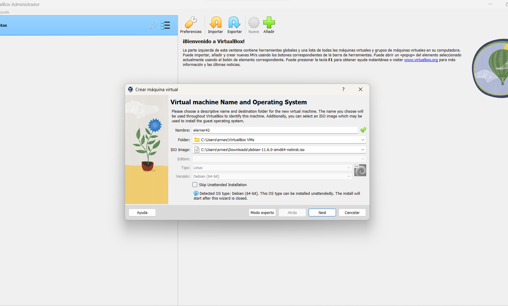
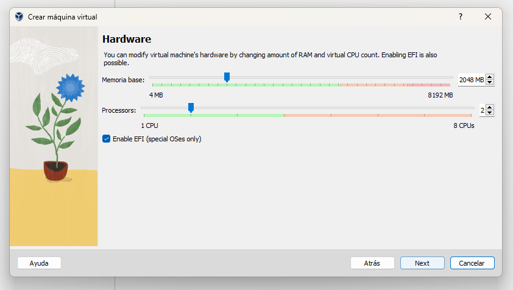
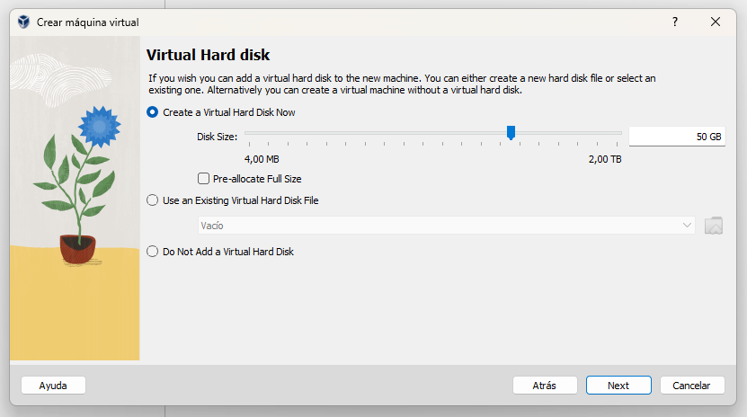
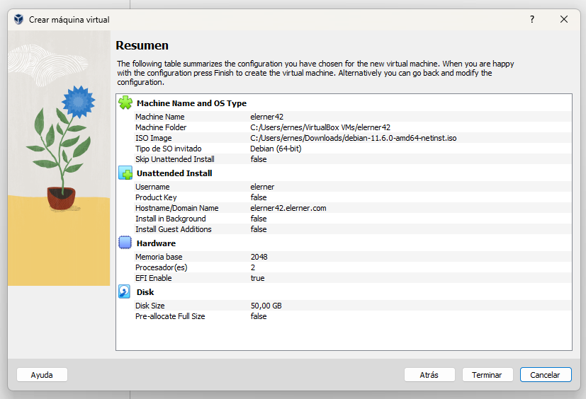
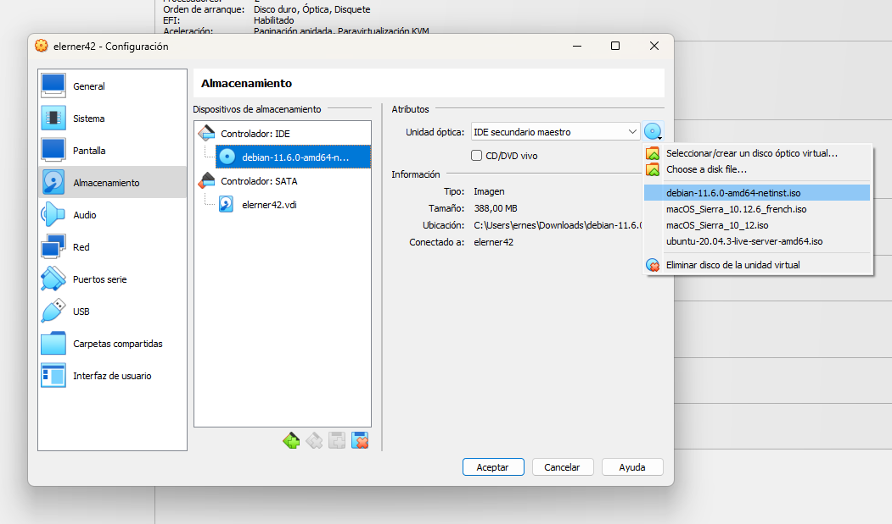

# 🚀 Born2beRoot Proyect - System Administration 👨‍💻
<pre>
<strong>Este documento con los pasos para un ejercicio de Administracion de Sistemas</strong>
</pre>
<pre>
<strong><h3> 🚔 🚨 ¡Parte Obligatoria!  🚨🚓</h3></strong>
Requisitos para Configurar un servidor DEBIAN:

  * ☑️ Prohibido configurar un servidor con interface grafica.
  * ☑️ <a href="#debian">Descargar la Version Estable de Debian y VirtualBox</a>
  * ☑️ Crear dos particiones "cifradas" usando LVM.
  * ☑️ Saber la diferencia de aptitude y apt.
  * Entender que es SELinux y AppArmor.
  * ☑️ Configurar Servicio SSH con el puerto: 4242, no puede conectarse como ROOT.
  * ☑️ Firewall UFM con DNF, debe tener solo el puerto 4242 abierto, inicio automático al iniciar el server.
  * ☑️ El hostname sera: <login42>+42 Ej: elerner42.
  * ☑️ Implementar una politica de Contraseña fuerte (ver pagina 6, al final para las politicas de contraseña de los grupos).
  * ☑️ Instalar y configurar SUDO siguiendo reglas estrictas.
  * ☑️ Crear un usuario con tu login, ademas del usuario ROOT.
  * ☑️Crear un Grupo user42.
  * ☑️ El usuario con tu login debe pertenecer a los grupos user42 y sudo.
  * ☑️ tener un archivo de configuracion para cambiar todas las contraseñas con las politicas dadas.
  * ☑️ Crear un SCRIPT en bash llamado monitoring.sh que iniciara al iniciar el servidor (ver pagina 8).
  * ☑️Usar el comando para comprobar algunos requisitos de Subject: ej: "root@wil:~# head -n 2 /etc/os-release".
  
<strong><h3> 💥 🍔 ¡Parte BONUS!  🍔 💥 </h3></strong>
  * Configurar correctamente las particiones y obtener una estructura como en la pagina 10.
  * Configurar WordPress funcional con los servicios: lighttpd, MariaDB, y PHP.
  * Ver servicios que puedan aportar mejoras a la parte Obligatoria. Ej: DNS, Sesiones de Usuarios,...etc.
  
</pre>

## Descargar Debian and VirtualBox

>* Accedemos al sitio para descargar la imagen ISO de DEBIAN,<strong> -> La Version Estable!</strong>. 
>
> 
>
>* Descargamos la ultima version estable de VirtualBox. 
>
> 
>
>### Instalamos VirtualBox y seguimos los siguientes pasos:
> #### Ejecutamos VirtualBox y Creamos una nueva maquina virtual de la siguiente manera:
>  
>       
> #### Configuramos la Memoria RAM.
> 
> 
> #### Configuramos el Disco Duro.
> 
> 
> #### Al terminar nos muestra un resumen de lo que hicimos.
> 
> 
> #### Para iniciar la Instalacion primeros verificamos si la imagen ISO DEBIAN esta seleccionada en la configuracion:
> 

